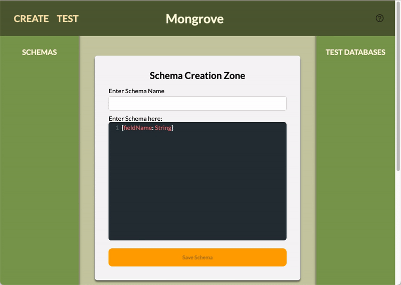
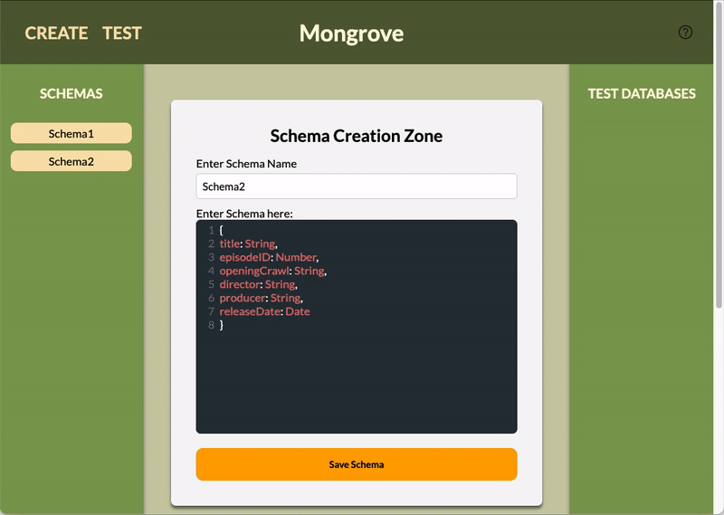

<b>Welcome to Mongrove!</b>

A databse analytics tool for MongoDB to compare and contrast metrics for various schemas and queries to MongoDB databses 

## Built With

- [Electron](https://www.electronjs.org/)
- [React](https://reactjs.org/)
- [Javascript](https://www.javascript.com/)
- [Docker](https://www.docker.com/)
- [MongoDB](https://www.mongodb.com/)
- [Mongoose](https://mongoosejs.com/)
- [D3](https://d3js.org/)
- [Faker.js](https://github.com/marak/Faker.js/)
- [CodeMirror](https://codemirror.net/)
- [Electron Builder](https://www.electron.build/)
- [Jest](https://jestjs.io/)
- [Enzyme](https://enzymejs.github.io/enzyme/)

## Set Up 

- Database setup:
  - Option 1: Using a containerized database (Recommended)
    - Install the latest version of [Docker](https://www.docker.com/) if you want to use a containerized database
    - Run the following command in a terminal: `docker run -d -p 27018:27017 mongo`
  - Option 2: Using a local instance of MongoDB
    - Install a local instance of [MongoDB](https://docs.mongodb.com/manual/installation/) if you don't want to use a containeized database
    - Run the following command in a terminal `mongo --port 27018`
- Download and install the latest version of Mongrove

## Using Mongrove

- Schema Creation Area
  - Start by generating a schema that will be used as a model to populate your test database
  - Pick a name for your schema
  - Enter your schema into the code editor
    - Make sure to format it as follows: \
     `{fieldName1: dataType1, fieldName2: dataType2}`
    - Field Names must be alphabetic
    - Currently supported data types are: 
      - String
      - Number
      - Boolean
      - Date
      - Array
      - Decimal128 
  - Click the 'Save Schema' button to save your schema

  

- Database configuration Area
  - Pick a name for your current database configuration
  - Select the previously saved schema that you would like to use for this database
  - Enter the number of documents that you would like the test database to have
  - Click the configure test database button

  

- Test Page
  - Click the 'Test' button in the NavBar to run queries
  - Select the previously configured database that you would like to run your current query on
  - Enter a name for your query
  - Enter the query that you would like to run on the selected database in the code editor
    - Only enter the query without including a model name
    - For example, if you want to run `db.find().limit(10)` enter `find().limit(10)`, in the code editor
  - Click the 'Run Query' button 
  - Your query results will be populated below
  - You can unselect a query in the 'Query Panel' on the left if you don't want to display it
  - By clicking the 'Sort By Time' checkbox in the graph area, you will get the selected queries sorted by query response time in ascending order

  

  

  

## Contributing
Mongrove is an open-source project thatwould be grateful for any contributions made by the open-source community. Please feel free to submit pull requests or report any issues in the issues tab. Thank you for your interest in making Mongrove a better product! 

## Core Team
Allana Ordonez: [GitHub](https://github.com/allanao) | [LinkedIn](https://www.linkedin.com/in/allana-ordonez/) \
Peter Van: [GitHub](https://github.com/peterrvan
) | [LinkedIn](https://www.linkedin.com/in/peter-van/
) \
Sushanth Kambham: [GitHub](https://github.com/sushanth913) | [LinkedIn](https://www.linkedin.com/in/sushanth-kambham) \
Yael Ofer: [GitHub](https://github.com/YaelWOfer) | [LinkedIn](https://github.com/peterrvan
)

Developed under Tech Accelerator [OS Labs](https://opensourcelabs.io/)